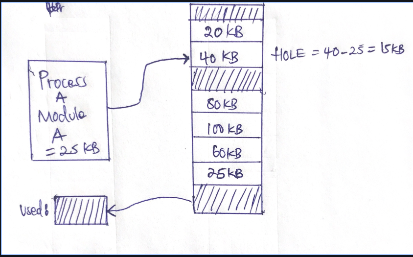
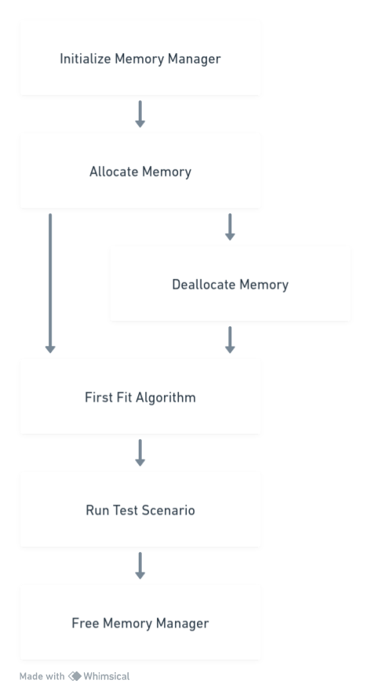
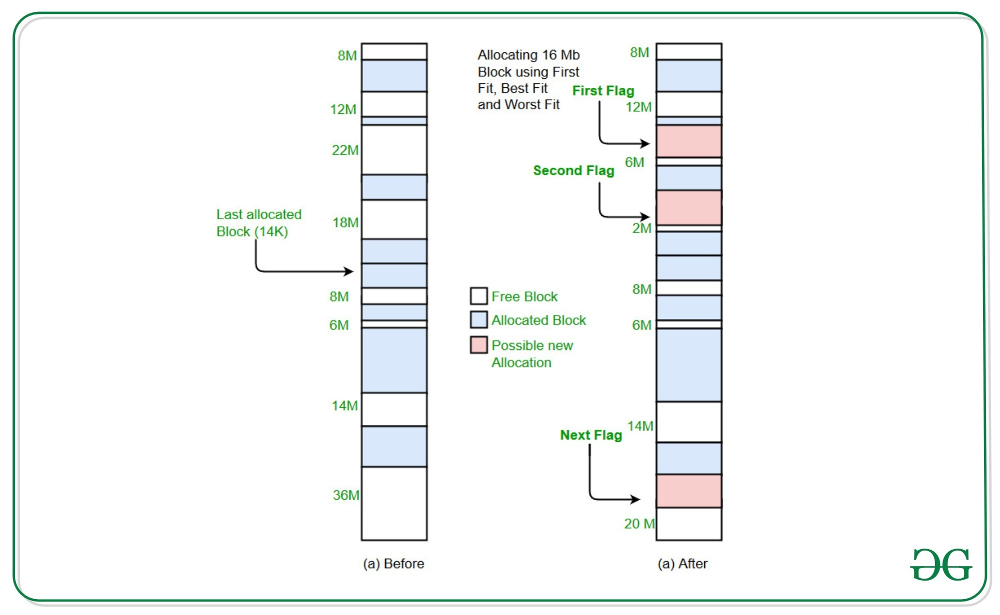

# Bitnine Memory Manager "clone"

Memory Management is part of complex softwares. Memory Manager is given a fixed size
memory block called memory pool. Different modules in that software request different-sized
blocks of memory from Manager. Manager uses first-fit algorithm to get requested blocks from
memory pool. Upon finding the first-fit block from memory pool, Manager passes it to the
requesting module. When a module does not need the allocated memory anymore, the memory
block is returned to Manager so that Manager merges it back into the memory pool. This is done
so that Manager can allocate it to some other module on request.

[**Initialize Memory Manager:**](https://github.com/kintokeanu/justChere/blob/main/BMM/initialize_memory.c)

- Allocate memory for the MemoryManager struct.
- Allocate memory for the memory pool using malloc.
- Initialize the first block of the memory pool as the initial free block.

[**Allocate Memory:**](https://github.com/kintokeanu/justChere/blob/main/BMM/allocate_memory.c)

- When a memory allocation is requested, check if the inputs are valid.
- Ensure there is enough space in the memory pool for the requested size plus the MemoryBlock overhead.
- Use the first_fit algorithm to find the first available block that can accommodate the requested size.
- If found, mark the block as allocated, update its size, and possibly split the block if there's remaining space.
- Return a pointer to the allocated memory region (skip MemoryBlock overhead).

[**Deallocate Memory:**](https://github.com/kintokeanu/justChere/blob/main/BMM/deallocate_memory.c)

- When memory is deallocated, retrieve the MemoryBlock structure associated with the provided pointer.
- Check if the block is within the memory pool's boundaries and if it's actually allocated.
- Mark the block as unallocated.

[**First Fit Algorithm:**](https://github.com/kintokeanu/justChere/blob/main/BMM/first_fit_algorithm.c)

- Traverse the memory pool, block by block, until a suitable free block is found.
- The block should have enough size to accommodate the requested memory plus the MemoryBlock overhead.
- Return a pointer to the found block.

[**Run Test Scenario:**](https://github.com/kintokeanu/justChere/blob/main/BMM/test_bed.c)

- For each test scenario, initialize a random number generator with a seed.
- Allocate an array of pointers to store allocated memory pointers.
- Loop through the specified number of allocation and deallocation requests.
- For each allocation, use random values for block size within the specified range.
- If allocation is successful, update statistics and allocated memory pointers.
- For each deallocation, randomly select an allocated memory pointer and deallocate it.
- Calculate and store allocation and deallocation times, sizes, and other statistics.
- Print statistics for the test scenario.

[**Free Memory Manager:**](https://github.com/kintokeanu/justChere/blob/main/BMM/free_memory.c)

- Free the memory pool using free.
- Free the MemoryManager struct.

# Compilation instructions

**Memory Manager Test Run Instructions**

Follow these instructions to compile and run the program, as well as interpret the output statistics.

**Compilation:**

*Open a terminal window and Navigate to the project directory using the cd command:*

`cd path/to/project/directory`

*Compile the code using the following command:*

└─$ `gcc -Wall -Wextra -Werror -pedantic  -std=gnu89 *.c -o memory_manager`

*Running the Program:*

└─$ `./memory_manager` 

The program will execute a series of test scenarios with different pool sizes, maximum block sizes, and numbers of requests. The output will display statistics for each test scenario, including total allocations, total deallocations, average allocation time, average deallocation time, maximum allocated size, minimum allocated size, average allocated size, and total failed allocation requests.

# Interpreting Output Statistics:

The output statistics provide insights into how the memory manager performs under various scenarios.

*Here's how to interpret the key statistics:*

- *Pool size*: The size of the memory pool used for allocations.
- *Max block size*: The maximum size of a memory block that can be allocated.
- *Total allocations*: The total number of successful memory allocations.
- *Total deallocations*: The total number of memory deallocations.
- *Average allocation time*: The average time taken for successful memory allocations (in seconds).
- *Average deallocation time*: The average time taken for memory deallocations (in seconds).
- *Maximum allocated size*: The largest size of memory block allocated.
- *Minimum allocated size*: The smallest size of memory block allocated.
- *Average allocated size*: The average size of memory blocks allocated.
- *Total failed allocation requests*: The total number of allocation requests that failed due to insufficient space.

# Example:

Test scenario
- Pool size: 1048576, Max block size: 128
- Total allocations: 100
- Total deallocations: 1
- Average allocation time: 0.000004 seconds
- Average deallocation time: 0.000003 seconds
- Maximum allocated size: 140 bytes
- Minimum allocated size: 2 bytes
- Average allocated size: 61.67 bytes
- Total failed allocation requests: 0

In this example, the program executed a test scenario with a *pool size of 1048576 bytes* and a *maximum block size of 128 bytes*. It performed 1*00 successful allocations* and *1 deallocation*. The *average allocation time was 0.000004 seconds*, and the *average deallocation time was 0.000003 seconds* which is pretty quick. The *maximum allocated size was 140 bytes*, the *minimum allocated size was 2 bytes*, and the *average allocated size was 61.67 bytes*. There were no failed allocation requests.

# Design

I will provide a comprehensive explanation of the design choices, algorithms, and data structures used to build the memory manager. Additionally, I'll discuss the rationale behind these decisions and how they contribute to the overall functionality and efficiency of the memory manager.

**Design Overview:**

- The memory manager is designed to efficiently allocate and deallocate blocks of memory from a fixed-size memory pool.
- The key goals of the design include minimizing fragmentation, providing fast allocation and deallocation, and accommodating different block sizes.

**Memory Pool:**

- A memory pool is created using a contiguous block of memory.
- This pool serves as the source of memory for allocations.
- The pool is divided into Memory Blocks, where each block is preceded by a metadata structure (MemoryBlock).
- The metadata helps in keeping track of whether a block is allocated or free.

**MemoryBlock Structure:**

*The MemoryBlock structure includes two main fields:*

- *size*: The size of the memory block.
- *is_allocated*: A flag indicating whether the block is currently allocated or free.

**MemoryManager Structure:**

- The MemoryManager structure is used to manage the memory pool and other related data. It includes:

+ *memory_pool*: A pointer to the memory pool.
+ *pool_size*: The total size of the memory pool.

# Algorithms:

**Allocation Algorithm (First Fit):**

- The First Fit algorithm is employed for allocating memory blocks.
- When an allocation request is made, the memory manager searches for the first available free block that can accommodate the requested size.
- This minimizes fragmentation and helps in efficient utilization of memory.

**Deallocation Algorithm:**

- Deallocating memory involves marking a MemoryBlock as free.
- This allows previously allocated blocks to be reused for future allocations, reducing fragmentation.

# Data Structures:

- *Memory Pool*: A contiguous block of memory used for allocations and deallocations.

- *MemoryBlock Structure*: Each block in the memory pool contains metadata (MemoryBlock structure) that helps in tracking block status and size.

# Rationale for Design Choices:

- *Memory Pool*: Using a pre-allocated memory pool reduces the overhead of frequent system calls to allocate and deallocate memory. This improves overall efficiency and reduces memory fragmentation.

- *First Fit Allocation*: The First Fit algorithm is simple and fast, making it a good choice for this implementation. It balances between allocating the requested size and minimizing fragmentation.

- *MemoryBlock Metadata*: The inclusion of metadata before each memory block helps in efficiently managing and tracking block status. This metadata is crucial for accurate deallocation and future allocations.

# Conclusion:

The memory manager's design is focused on achieving efficient memory utilization, fast allocation, and accurate deallocation. By using a memory pool and the First Fit algorithm, the memory manager optimizes memory usage and reduces fragmentation. The use of MemoryBlock metadata ensures effective tracking of block status and size, contributing to the overall robustness of the system. This design provides a strong foundation for managing memory in resource-constrained environments.
