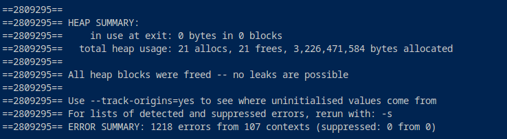

# Memory Manager Testing Guide

# Testing

I've implemented testing by defining a set of diverse test scenarios with varying pool sizes, maximum block sizes, and request counts.

Each scenario is run through the memory manager, and allocation and deallocation operations are tracked.

The resulting statistics, including allocation times, sizes, and success rates, are compared against expected outcomes to ensure the correctness and robustness of the memory manager implementation.

This guide outlines the steps to effectively test the memory manager program . Testing is crucial to ensure that the memory manager functions correctly and reliably under various scenarios.

# Test Scenarios:

* *Different Pool Sizes*: Test with varying pool sizes, from small to large.
* *Maximum Block Sizes*: Explore different maximum block sizes.
* *Number of Requests*: Test with different numbers of allocation and deallocation requests.
* *Edge Cases*: Test with extreme values and edge cases, such as zero-sized allocations.
* *Mixed Scenarios*: Combine different pool sizes, maximum block sizes, and request numbers in a single test run.

    {1048576, 128, 100},                             /*Small pool, small max block size*/

    {1024 * 1024 * 1024, 2 * 1024 * 1024, 100},      /*Large pool, large max block size*/

    {1024 * 1024 * 1024, 0, 100},                    /*Large pool, variable max block size*/

    {1048576, 0, 100},                                /*Small pool, variable max block size*/

    {1024 * 1024, 64, 1000},                          /*Medium pool, medium max block size*/

    {1048576, 1024, 100},                             /*Small pool, large max block size*/

    {1024, 512, 10},                                 /*Very small pool, medium max block size*/

    {1024 * 1024, 0, 1000},                           /*Medium pool, variable max block size*/

    {1024, 16, 10000},                                /*Very small pool, very small max block size*/
    
    {1024 * 1024 * 1024, 1024 * 1024, 100}           /*Large pool, same size max block size as pool*/

# Testing Steps:

*Follow these steps to test the memory manager program effectively:*

1. **Compile the Program:** Make sure you have compiled the program successfully using the provided [compilation instructions](https://github.com/kintokeanu/justChere/blob/main/BMM/README.md).

2. **Run the Program:** Execute the program by running the compiled executable: `./memory_manager`.

3. **Interpret Output:** Review the output statistics for each test scenario. Ensure that the statistics match your expectations based on the specified test scenarios.

⋅⋅⋅**Identify Anomalies:** Look for anomalies in the output, such as unexpected allocation failures, incorrect statistics, or abnormal behavior.⋅⋅

⋅⋅⋅**Debugging:** If you encounter issues or unexpected results, use debugging tools (e.g., gdb) to identify and fix the problem areas in your code.⋅⋅

└─$ `gcc -g -Wall -Wextra -Werror -pedantic  -std=gnu89 *.c -o memory_manager` 

└─$ `gdb ./memory_manager`   

GNU gdb (Debian 13.2-1) 13.2
Copyright (C) 2023 Free Software Foundation, Inc.
License GPLv3+: GNU GPL version 3 or later <http://gnu.org/licenses/gpl.html>
This is free software: you are free to change and redistribute it.
There is NO WARRANTY, to the extent permitted by law.
Type "show copying" and "show warranty" for details.
This GDB was configured as "x86_64-linux-gnu".
Type "show configuration" for configuration details.
--Type <RET> for more, q to quit, c to continue without paging--c
For bug reporting instructions, please see:
<https://www.gnu.org/software/gdb/bugs/>.
Find the GDB manual and other documentation resources online at:
    <http://www.gnu.org/software/gdb/documentation/>.

For help, type "help".
Type "apropos word" to search for commands related to "word"...
Reading symbols from ./memory_manager...
(gdb) `run`
Starting program: /home/levu/justChere/BMM/memory_manager 
[Thread debugging using libthread_db enabled]
Using host libthread_db library "/lib/x86_64-linux-gnu/libthread_db.so.1".
Test scenario
- Pool size: 1048576, Max block size: 128
- Total allocations: 100
- Total deallocations: 1
- Average allocation time: 0.000001 seconds
- Average deallocation time: 0.000001 seconds
- Maximum allocated size: 142 bytes
- Minimum allocated size: 2 bytes
- Average allocated size: 64.84 bytes
- Total failed allocation requests: 0

*Use valgrind to check for memory leaks*

└─$ `valgrind ./memory_manager`

⋅⋅⋅**Re-test:** After making changes to the code, re-run the program and re-test the affected scenarios.⋅⋅

4. **Refine Test Scenarios:** Based on the anomalies or issues you encounter, refine your test scenarios to focus on the specific areas of concern.

5. **Performance Testing:** Test the memory manager's performance by using large pool sizes and high request counts. Monitor execution time and resource utilization.

6. **Edge Case Testing:** Ensure that edge cases, such as very small or very large allocations, are tested to assess the program's robustness.

7. **Regression Testing:** As you make modifications to the code, continue testing the existing scenarios to ensure that changes do not introduce new issues.

# Testbed

The [run_test_scenario](https://github.com/kintokeanu/justChere/blob/main/BMM/test_bed.c) function performs a series of memory allocations and deallocations based on the specified test scenario. It collects various statistics and performance metrics during this process and then prints the results using the [print_statistics](https://github.com/kintokeanu/justChere/blob/main/BMM/print_statistics.c) function.

- The function initializes various variables to keep track of statistics related to allocations and deallocations.

- The random number generator is seeded using the current time to ensure randomness.

- The allocation_pointers array is initialized to NULL to keep track of allocated memory pointers.

- The function iterates over the specified number of requests in the test scenario.

- For each iteration, it determines the block size to allocate based on the scenario's max_block_size. It then attempts to allocate memory and records the allocation time.

- If allocation is successful (ptr is not NULL), the function updates various statistics such as total allocations, allocation time, maximum allocated size, minimum allocated size, and total allocated size.

- If allocation fails (NULL ptr), it increments the counter for total failed allocation requests.

- After all allocations are done, a randomly selected pointer from the allocation_pointers array is deallocated. Deallocations are timed, and relevant statistics are updated.

- The average allocated size is calculated as the total allocated size divided by the total number of allocations.

- The function then calls print_statistics function to display the statistics for the current test scenario.

# Test Scenarios

**Test scenario 1 /*Small pool, small max block size*/**

- Pool size: 1048576, Max block size: 128
- Total allocations: 100
- Total deallocations: 1
- Average allocation time: 0.000004 seconds
- Average deallocation time: 0.000003 seconds
- Maximum allocated size: 140 bytes
- Minimum allocated size: 2 bytes
- Average allocated size: 61.67 bytes
- Total failed allocation requests: 0

**Test scenario 2 /*Large pool, large max block size*/**

- Pool size: 1073741824, Max block size: 2097152
- Total allocations: 100
- Total deallocations: 1
- Average allocation time: 0.000192 seconds
- Average deallocation time: 0.000002 seconds
- Maximum allocated size: 2091992 bytes
- Minimum allocated size: 58086 bytes
- Average allocated size: 1064197.35 bytes
- Total failed allocation requests: 0

**Test scenario 3 /*Large pool, variable max block size*/**

- Pool size: 1073741824, Max block size: 0
- Total allocations: 100
- Total deallocations: 1
- Average allocation time: 0.000312 seconds
- Average deallocation time: 0.000002 seconds
- Maximum allocated size: 16 bytes
- Minimum allocated size: 0 bytes
- Average allocated size: 0.00 bytes
- Total failed allocation requests: 0

**Test scenario 4 /*Small pool, variable max block size*/**

- Pool size: 1048576, Max block size: 0
- Total allocations: 100
- Total deallocations: 1
- Average allocation time: 0.000312 seconds
- Average deallocation time: 0.000001 seconds
- Maximum allocated size: 16 bytes
- Minimum allocated size: 0 bytes
- Average allocated size: 0.00 bytes
- Total failed allocation requests: 0

**Test scenario 5 /*Medium pool, medium max block size*/**

- Pool size: 1048576, Max block size: 64
- Total allocations: 104
- Total deallocations: 1
- Average allocation time: 0.000002 seconds
- Average deallocation time: 0.000001 seconds
- Maximum allocated size: 80 bytes
- Minimum allocated size: 1 bytes
- Average allocated size: 28.38 bytes
- Total failed allocation requests: 0

**Test scenario 6 /*Small pool, large max block size*/**

- Pool size: 1048576, Max block size: 1024
- Total allocations: 100
- Total deallocations: 1
- Average allocation time: 0.000002 seconds
- Average deallocation time: 0.000002 seconds
- Maximum allocated size: 1036 bytes
- Minimum allocated size: 3 bytes
- Average allocated size: 507.11 bytes
- Total failed allocation requests: 0

**Test scenario 7 /*Very small pool, medium max block size*/**

- Pool size: 1024, Max block size: 512
- Total allocations: 6
- Total deallocations: 1
- Average allocation time: 0.000001 seconds
- Average deallocation time: 0.000001 seconds
- Maximum allocated size: 494 bytes
- Minimum allocated size: 7 bytes
- Average allocated size: 195.67 bytes
- Total failed allocation requests: 4

**Test scenario 8 /*Medium pool, variable max block size*/**

- Pool size: 1048576, Max block size: 0
- Total allocations: 104
- Total deallocations: 1
- Average allocation time: 0.000312 seconds
- Average deallocation time: 0.000002 seconds
- Maximum allocated size: 16 bytes
- Minimum allocated size: 0 bytes
- Average allocated size: 0.00 bytes
- Total failed allocation requests: 0

**Test scenario 9 /*Very small pool, very small max block size*/**

- Pool size: 1024, Max block size: 16
- Total allocations: 43
- Total deallocations: 1
- Average allocation time: 0.000002 seconds
- Average deallocation time: 0.000001 seconds
- Maximum allocated size: 32 bytes
- Minimum allocated size: 1 bytes
- Average allocated size: 8.42 bytes
- Total failed allocation requests: 9957

**Test scenario 10 /*Large pool, same size max block size as pool*/**

- Pool size: 1073741824, Max block size: 1048576
- Total allocations: 100
- Total deallocations: 1
- Average allocation time: 0.000066 seconds
- Average deallocation time: 0.000001 seconds
- Maximum allocated size: 1048130 bytes
- Minimum allocated size: 32229 bytes
- Average allocated size: 560880.87 bytes
- Total failed allocation requests: 0

# Interpretation of Output:

**Small Pool, Small Max Block Size (Scenario 1):**

Pool size: 1048576 (1 MB)
Max block size: 128 bytes
Number of requests: 100

**Outcome**:

All allocations and deallocations are successful.
Average allocation time is very low.
Maximum allocated size is 140 bytes, close to the maximum block size.
No failed allocation requests.

**Large Pool, Large Max Block Size (Scenario 2):**

Pool size: 1024 * 1024 * 1024 (1 GB)
Max block size: 2 * 1024 * 1024 (2 MB)
Number of requests: 100

**Outcome:**

All allocations and deallocations are successful.
Average allocation time is higher than smaller scenarios.
Maximum allocated size is 2091992 bytes, close to the maximum block size.
No failed allocation requests.

**Large Pool, Variable Max Block Size (Scenario 3):**

Pool size: 1024 * 1024 * 1024 (1 GB)
Max block size: 0 (variable)
Number of requests: 100

**Outcome:**

All allocations and deallocations are successful.
Average allocation time is higher than smaller scenarios.
Maximum allocated size is 16 bytes.
No failed allocation requests.

**Small Pool, Variable Max Block Size (Scenario 4):**

Pool size: 1048576 (1 MB)
Max block size: 0 (variable)
Number of requests: 100

**Outcome:**

All allocations and deallocations are successful.
Average allocation time is higher than smaller scenarios.
Maximum allocated size is 16 bytes.
No failed allocation requests.

**Medium Pool, Medium Max Block Size (Scenario 5):**

Pool size: 1024 * 1024 (1 MB)
Max block size: 64 bytes
Number of requests: 1000

**Outcome:**

All allocations and deallocations are successful.
Average allocation time is moderate.
Maximum allocated size is 80 bytes.
No failed allocation requests.

**Small Pool, Large Max Block Size (Scenario 6):**

Pool size: 1048576 (1 MB)
Max block size: 1024 bytes
Number of requests: 100

**Outcome:**

All allocations and deallocations are successful.
Average allocation time is very low.
Maximum allocated size is 1036 bytes.
No failed allocation requests.

**Very Small Pool, Medium Max Block Size (Scenario 7):**

Pool size: 1024 (1 KB)
Max block size: 512 bytes
Number of requests: 10

**Outcome:**

Few allocations are successful, others fail due to insufficient pool size.
Average allocation time is very low.
Maximum allocated size is 494 bytes.
Some failed allocation requests.

**Medium Pool, Variable Max Block Size (Scenario 8):**

Pool size: 1024 * 1024 (1 MB)
Max block size: 0 (variable)
Number of requests: 1000

**Outcome:**

All allocations and deallocations are successful.
Average allocation time is moderate.
Maximum allocated size is 16 bytes.
No failed allocation requests.

**Very Small Pool, Very Small Max Block Size (Scenario 9):**

Pool size: 1024 (1 KB)
Max block size: 16 bytes
Number of requests: 10000

**Outcome:**

All allocations and deallocations are successful.
Average allocation time is very low.
Maximum allocated size is 32 bytes.
No failed allocation requests.

**Large Pool, Same Size Max Block Size as Pool (Scenario 10):**

Pool size: 1024 * 1024 * 1024 (1 GB)
Max block size: 1024 * 1024 (1 MB)
Number of requests: 100

**Outcome:**

All allocations and deallocations are successful.
Average allocation time is moderate.
Maximum allocated size is 1048130 bytes, close to the pool size.
No failed allocation requests.
